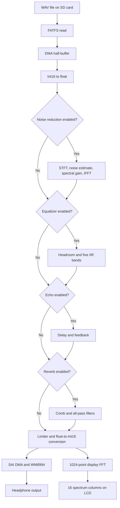

# STM32 Audio DSP Player

A real-time audio player and DSP platform built on the **STM32F746G-DISCO**. The project reads stereo WAV files from an SD card, processes the audio in real time, displays a live spectrum on the LCD, and provides TouchGFX controls for playback, equalization, and audio effects.

> Current stable release: **v1.0.1**

## Features

- WAV playback from an SD card using FATFS
- Double-buffered audio streaming with DMA
- WM8994 codec output through SAI
- TouchGFX graphical interface
- Play/Pause, Next, Previous, and volume controls
- Real-time 16-column spectrum visualization
- Five-band parametric equalizer
- Automatic EQ headroom and output limiter
- Echo effect with feedback
- Schroeder-style reverb using parallel comb and all-pass filters
- Adaptive spectral noise reduction
- Independent enable/disable controls for audio effects

## Hardware and software

| Component | Details |
|---|---|
| Development board | STM32F746G-DISCO |
| MCU | STM32F746NG, Arm Cortex-M7 |
| Audio codec | WM8994 |
| Audio interface | SAI2 with DMA |
| Display framework | TouchGFX 4.26 |
| DSP library | CMSIS-DSP |
| Storage | SD card with FATFS |
| Audio test format | Stereo PCM, 16-bit, 48 kHz |
| Build environment | STM32CubeIDE |
| Flash tools | STM32CubeIDE integrated ST-LINK support or pyOCD |

## Audio processing pipeline



The display FFT is an analysis branch. It observes the processed signal but does not modify the audio. Codec volume is applied after this FFT, so hardware volume changes do not affect the displayed spectrum.

## Real-time audio buffering

The player uses an 8192-byte audio buffer divided into two 4096-byte halves. For stereo 16-bit audio, each half contains 1024 stereo frames:

```text
4096 bytes / (2 channels × 2 bytes) = 1024 frames
```

At 48 kHz, each half-buffer represents approximately:

```text
1024 / 48000 = 21.33 ms
```

The CPU must read and process each half before the DMA reaches it again.

## Five-band equalizer

The equalizer contains five peaking IIR biquad filters:

| Band | Center frequency | Gain range |
|---|---:|---:|
| Low bass | 100 Hz | -12 to +12 dB |
| Low-mid | 300 Hz | -12 to +12 dB |
| Mid | 1 kHz | -12 to +12 dB |
| Upper-mid | 3 kHz | -12 to +12 dB |
| Treble | 8 kHz | -12 to +12 dB |

Each channel uses a CMSIS-DSP Direct Form I biquad cascade. Automatic preamp headroom is applied when bands are boosted, followed by a limiter to prevent clipping.

## Spectrum visualization

A 1024-point real FFT is calculated from the processed stereo signal:

1. Left and right channels are averaged.
2. DC offset is removed.
3. A Hann window is applied.
4. CMSIS-DSP calculates the real FFT.
5. FFT magnitudes are grouped into 16 non-linear bands.
6. Temporal smoothing reduces visible flicker.
7. TouchGFX displays the resulting columns.

## Echo

The echo uses a stereo circular delay buffer:

```text
output[n] = (1 - mix) × input[n] + mix × delayed[n]
buffer[n] = input[n] + feedback × delayed[n]
```

The delay buffer is stored in external SDRAM.

## Reverb

The reverb is based on a Schroeder structure:

- Four parallel comb filters per channel
- Damping inside the comb feedback paths
- Two serial all-pass filters per channel
- Slightly different left/right delays for stereo width
- Dry/wet output mixing

The reverb and echo are disabled by default after reset.

## Adaptive noise reduction

Noise reduction uses a 512-point short-time Fourier transform with 50% overlap and a square-root Hann window.

For each frequency bin:

```text
P[k] = Re(X[k])² + Im(X[k])²
N[k] = βN[k] + (1 - β)P[k]
G[k] = max(Gmin, 1 - αN[k] / (P[k] + ε))
Y[k] = G[k]X[k]
```

Where:

- `P[k]` is the current spectral power.
- `N[k]` is the adaptive noise-power estimate.
- `G[k]` is the spectral attenuation.
- Temporal and frequency smoothing reduce musical-noise artifacts.
- IFFT and overlap-add reconstruct the output signal.

The implementation has been tested with street-noise speech samples at **5 dB, 10 dB, and 15 dB SNR**.

## TouchGFX screens

### Player screen

- Live spectrum
- Current track name
- Play/Pause
- Previous/Next
- Volume up/down
- Navigation to Equalizer and Effects

### Equalizer screen

- Five gain sliders
- Gain values in dB
- Flat preset
- Persistent values when switching screens

### Effects screen

- Echo toggle
- Reverb toggle
- Noise Reduction toggle

## Test playlist

The current firmware uses a fixed six-track playlist:

```text
one.wav
two.wav
three.wav
four.wav
five.wav
six.wav
```

Tracks 4, 5, and 6 are used for noise-reduction tests at 5 dB, 10 dB, and 15 dB SNR respectively.

## Build and flash

1. Generate TouchGFX assets on Windows when the UI is modified.
2. Open the project in STM32CubeIDE on Windows or macOS.
3. Select the Debug configuration and apply the required settings below.
4. Clean and build the project.
5. Connect the STM32F746G-DISCO through its ST-LINK USB connector.
6. Program the board using STM32CubeIDE or pyOCD.

### Required compiler optimization

Real-time DSP can miss the 21.33 ms DMA half-buffer deadline when compiled
without optimization. Set both compilers to **Optimize for speed (-Ofast)**:

```text
Project → Properties → C/C++ Build → Settings → Tool Settings
MCU/MPU GCC Compiler → Optimization → Optimize for speed (-Ofast)
MCU/MPU G++ Compiler → Optimization → Optimize for speed (-Ofast)
```

Verify that the build commands contain `-Ofast` instead of `-O0`.
Running the effects with `-O0` may cause buffer underruns, audible noise,
or broken playback.

### TouchGFX library path

For GCC builds, add the TouchGFX precompiled library directory under:

```text
Project → Properties → C/C++ Build → Settings
→ Tool Settings → MCU/MPU G++ Linker → Libraries
```

Add this value to **Library search path (-L)**:

```text
${workspace_loc:/${ProjName}/Middlewares/ST/touchgfx/lib/core/cortex_m7/gcc}
```

If the workspace variable is not resolved, use:

```text
../Middlewares/ST/touchgfx/lib/core/cortex_m7/gcc
```

The Libraries list must contain:

```text
:libtouchgfx-float-abi-hard.a
```

Use the `gcc` directory, not `stclang`. A missing search path produces:

```text
cannot find -l:libtouchgfx-float-abi-hard.a
```

### STM32CubeIDE

Use the integrated ST-LINK programmer:

- To program and run: **Run → Run As → STM32 C/C++ Application**, or click the green Run button.
- To program and debug: **Run → Debug As → STM32 C/C++ Application**, or click the Debug button.

STM32CubeIDE loads the generated `Debug/V1.elf` file and starts the application automatically.

### pyOCD

From a terminal in the project directory:

```bash
cd ~/Developer/stm32/V1
pyocd flash -t stm32f746nghx Debug/V1.elf
```

## Repository structure

```text
Core/Src/main.c                         Hardware initialization and WAV playback
Core/Src/audio_pipeline.c               DSP stage order, PCM conversion, and limiter
Core/Src/audio_equalizer.c              Five-band biquad equalizer
Core/Src/audio_echo.c                   Stereo delay and feedback echo
Core/Src/audio_reverb.c                 Schroeder comb and all-pass reverb
Core/Src/noise_reduction.c               Adaptive STFT spectral subtraction
Core/Src/audio_spectrum.c                Display FFT and 16 smoothed bands
Core/Src/freertos.c                     Player task, playlist, and DMA refill flow
TouchGFX/gui/src/model/                 UI-to-firmware interface
TouchGFX/gui/src/screen1_screen/        Player screen logic
TouchGFX/gui/src/equalizerscreen_screen Equalizer screen logic
TouchGFX/gui/src/effectsscreen_screen/  Effects screen logic
```

## Benchmark plan

The following measurements will be added in a future documentation update. No unmeasured values are reported yet.

| Category | Planned measurement |
|---|---|
| CPU load | Average and worst-case cycles for each processing stage |
| Real-time margin | Processing time compared with the 21.33 ms DMA deadline |
| Stage cost | EQ, Echo, Reverb, Noise Reduction, display FFT, and TouchGFX |
| Audio stability | DMA underruns, missed refills, and long-duration playback |
| Memory | Flash, static RAM, stack, external SDRAM, and effect buffers |
| Latency | Buffering, STFT overlap, and total input-to-output delay |
| Equalizer | Measured frequency response for each band and gain setting |
| Echo | Actual delay time and feedback decay |
| Reverb | Impulse response and estimated RT60 |
| Noise reduction | Input/output SNR improvement at 5, 10, and 15 dB |
| Speech quality | SI-SDR/STOI or another reproducible quality metric |
| Output quality | Peak level, clipping count, THD+N, and noise floor |
| UI impact | Frame rate and audio-processing cost while TouchGFX is active |
| Power | Board current with effects disabled and enabled |

CPU timing will be measured with the Cortex-M7 DWT cycle counter around each DSP stage. Audio measurements will use known test signals and saved reference/output recordings where possible.

## Current limitations and future work

- Playlist filenames are currently fixed in firmware.
- WAV processing assumes the tested stereo PCM16 layout.
- Noise reduction is optimized for speech with background noise, not arbitrary music restoration.
- Effect parameters are compile-time constants.
- No automatic WAV-file discovery is implemented yet.
- Objective performance and audio-quality measurements are still pending.

Potential future improvements:

- Dynamic SD-card playlist
- Runtime effect controls
- EQ presets
- On-screen track browser
- Saved settings
- Automated DSP regression tests
- Release-mode optimization and profiling

## Release

The latest stable tag is [v1.0.1](https://github.com/alifarzanehrad/stm32-audio-dsp-player/tree/v1.0.1).

## License

Original application code and documentation are available under the [MIT License](LICENSE).

Generated code and third-party components, including STM32 HAL/BSP, CMSIS-DSP, FreeRTOS, FatFS, TouchGFX, and ST audio middleware, remain under their respective upstream licenses. See [THIRD_PARTY_NOTICES.md](THIRD_PARTY_NOTICES.md) for details.
