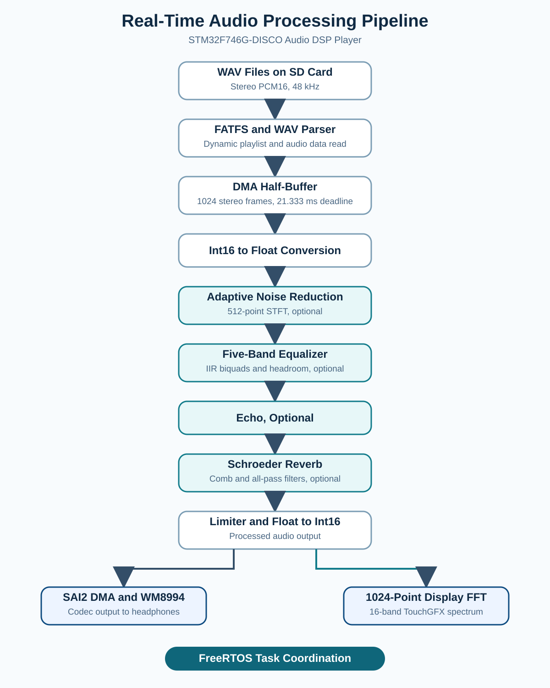

# STM32 Audio DSP Player

[](https://github.com/alifarzanehrad/stm32-audio-dsp-player/actions/workflows/ci.yml)

A real-time audio player and DSP platform built on the **STM32F746G-DISCO**. The project reads stereo WAV files from an SD card, processes the audio in real time, displays a live spectrum on the LCD, and provides TouchGFX controls for playback, equalization, and audio effects.

> Current stable release: **v1.2.0**

## Hardware demo

<p align="center">
  
</p>

The demo shows the project running on the physical STM32F746G-DISCO board with its TouchGFX interface and real-time spectrum visualization.

## Features

- WAV playback from an SD card using FATFS
- Double-buffered audio streaming with DMA
- WM8994 codec output through SAI
- TouchGFX graphical interface
- Play/Pause, Next, Previous, and volume controls
- Automatic WAV playlist discovery with long-filename support
- Dynamic current-track title on the player screen
- Horizontal swipe navigation across all four TouchGFX screens
- Real-time 16-column spectrum visualization
- Five-band parametric equalizer
- Flat, Pop, and Classical EQ presets
- Automatic EQ headroom and output limiter
- Echo effect with feedback
- Schroeder-style reverb using parallel comb and all-pass filters
- Adaptive spectral noise reduction
- Independent enable/disable controls for audio effects
- On-device CPU load, worst-case DSP time, deadline-miss, free-heap, and audio-stack monitoring

## Hardware and software

| Component | Details |
|---|---|
| Development board | STM32F746G-DISCO |
| MCU | STM32F746NG, Arm Cortex-M7 |
| Audio codec | WM8994 |
| Audio interface | SAI2 with DMA |
| Display framework | TouchGFX 4.26 |
| DSP library | CMSIS-DSP |
| Storage | SD card with FATFS |
| Audio test format | Stereo PCM, 16-bit, 48 kHz |
| Build environment | STM32CubeIDE |
| Flash tools | STM32CubeIDE integrated ST-LINK support or pyOCD |

## Audio processing pipeline

<p align="center">
  
</p>

The display FFT is an analysis branch. It observes the processed signal but does not modify the audio. Codec volume is applied after this FFT, so hardware volume changes do not affect the displayed spectrum.

## Real-time audio buffering

The player uses an 8192-byte audio buffer divided into two 4096-byte halves. For stereo 16-bit audio, each half contains 1024 stereo frames:

```text
4096 bytes / (2 channels × 2 bytes) = 1024 frames
```

At 48 kHz, each half-buffer represents approximately:

```text
1024 / 48000 = 21.33 ms
```

The CPU must read and process each half before the DMA reaches it again.

## Five-band equalizer

The equalizer contains five peaking IIR biquad filters:

| Band | Center frequency | Gain range |
|---|---:|---:|
| Low bass | 100 Hz | -12 to +12 dB |
| Low-mid | 300 Hz | -12 to +12 dB |
| Mid | 1 kHz | -12 to +12 dB |
| Upper-mid | 3 kHz | -12 to +12 dB |
| Treble | 8 kHz | -12 to +12 dB |

Each channel uses a CMSIS-DSP Direct Form I biquad cascade. Automatic preamp headroom is applied when bands are boosted, followed by a limiter to prevent clipping.

## Spectrum visualization

A 1024-point real FFT is calculated from the processed stereo signal:

1. Left and right channels are averaged.
2. DC offset is removed.
3. A Hann window is applied.
4. CMSIS-DSP calculates the real FFT.
5. FFT magnitudes are grouped into 16 non-linear bands.
6. Temporal smoothing reduces visible flicker.
7. TouchGFX displays the resulting columns.

## Echo

The echo uses a stereo circular delay buffer:

```text
output[n] = (1 - mix) × input[n] + mix × delayed[n]
buffer[n] = input[n] + feedback × delayed[n]
```

The delay buffer is stored in external SDRAM.

## Reverb

The reverb is based on a Schroeder structure:

- Four parallel comb filters per channel
- Damping inside the comb feedback paths
- Two serial all-pass filters per channel
- Slightly different left/right delays for stereo width
- Dry/wet output mixing

The reverb and echo are disabled by default after reset.

## Adaptive noise reduction

Noise reduction uses a 512-point short-time Fourier transform with 50% overlap and a square-root Hann window.

For each frequency bin:

```text
P[k] = Re(X[k])² + Im(X[k])²
N[k] = βN[k] + (1 - β)P[k]
G[k] = max(Gmin, 1 - αN[k] / (P[k] + ε))
Y[k] = G[k]X[k]
```

Where:

- `P[k]` is the current spectral power.
- `N[k]` is the adaptive noise-power estimate.
- `G[k]` is the spectral attenuation.
- Temporal and frequency smoothing reduce musical-noise artifacts.
- IFFT and overlap-add reconstruct the output signal.

The implementation has been tested with street-noise speech samples at **5 dB, 10 dB, and 15 dB SNR**.

## TouchGFX screens

### Player screen

- Live spectrum
- Current track name
- Play/Pause
- Previous/Next
- Volume up/down
- Swipe right to Equalizer and left to Effects

### Equalizer screen

- Five gain sliders
- Gain values in dB
- Flat, Pop, and Classical presets
- Persistent values when switching screens
- Slider-aware swipe handling that prevents accidental page changes
- Swipe left to Player

### Effects screen

- Echo toggle
- Reverb toggle
- Noise Reduction toggle
- Swipe right to Player and left to Performance

### Performance screen

- Live audio DSP CPU load
- Maximum measured DSP processing time
- Audio DMA deadline-miss counter
- Current FreeRTOS heap availability
- Minimum remaining audio-task stack space
- Swipe right to Effects

The screens form a linear navigation flow:

```text
Equalizer ←→ Player ←→ Effects ←→ Performance
```

The Player screen is shown at startup. Swiping left moves to the next screen and
swiping right moves to the previous screen. On the Equalizer screen, gestures
that begin on a gain slider are reserved for gain adjustment and never trigger a
screen transition.

## Dynamic SD-card playlist

At startup, the firmware scans the SD-card root directory, discovers up to 32
WAV files, sorts them by filename, and builds the playlist automatically. FatFs
long-filename support preserves descriptive English track names instead of 8.3
aliases such as `SOMETH~1.WAV`.

The player UI displays the selected filename without its `.wav` extension.
Underscores and hyphens are rendered as spaces for a cleaner title. Next,
Previous, and automatic end-of-track transitions all operate on the discovered
playlist, so filenames are no longer hardcoded in the firmware.

## Build and flash

1. Generate TouchGFX assets on Windows when the UI is modified.
2. Open the project in STM32CubeIDE on Windows or macOS.
3. Select the Debug configuration and apply the required settings below.
4. Clean and build the project.
5. Connect the STM32F746G-DISCO through its ST-LINK USB connector.
6. Program the board using STM32CubeIDE or pyOCD.

### Required compiler optimization

Real-time DSP can miss the 21.33 ms DMA half-buffer deadline when compiled
without optimization. Set both compilers to **Optimize for speed (-Ofast)**:

```text
Project → Properties → C/C++ Build → Settings → Tool Settings
MCU/MPU GCC Compiler → Optimization → Optimize for speed (-Ofast)
MCU/MPU G++ Compiler → Optimization → Optimize for speed (-Ofast)
```

Verify that the build commands contain `-Ofast` instead of `-O0`.
Running the effects with `-O0` may cause buffer underruns, audible noise,
or broken playback.

### TouchGFX library path

For GCC builds, add the TouchGFX precompiled library directory under:

```text
Project → Properties → C/C++ Build → Settings
→ Tool Settings → MCU/MPU G++ Linker → Libraries
```

Add this value to **Library search path (-L)**:

```text
${workspace_loc:/${ProjName}/Middlewares/ST/touchgfx/lib/core/cortex_m7/gcc}
```

If the workspace variable is not resolved, use:

```text
../Middlewares/ST/touchgfx/lib/core/cortex_m7/gcc
```

The Libraries list must contain:

```text
:libtouchgfx-float-abi-hard.a
```

Use the `gcc` directory, not `stclang`. A missing search path produces:

```text
cannot find -l:libtouchgfx-float-abi-hard.a
```

### STM32CubeIDE

Use the integrated ST-LINK programmer:

- To program and run: **Run → Run As → STM32 C/C++ Application**, or click the green Run button.
- To program and debug: **Run → Debug As → STM32 C/C++ Application**, or click the Debug button.

STM32CubeIDE loads the generated `Debug/V1.elf` file and starts the application automatically.

### pyOCD

From a terminal in the project directory:

```bash
cd ~/Developer/stm32/V1
pyocd flash -t stm32f746nghx Debug/V1.elf
```

## Repository structure

```text
Core/Src/main.c                         MCU and peripheral initialization
Core/Src/audio_player.c                 WAV parsing, DMA buffers, and codec playback
Core/Src/audio_pipeline.c               DSP stage order, PCM conversion, and limiter
Core/Src/audio_equalizer.c              Five-band biquad equalizer
Core/Src/audio_echo.c                   Stereo delay and feedback echo
Core/Src/audio_reverb.c                 Schroeder comb and all-pass reverb
Core/Src/noise_reduction.c               Adaptive STFT spectral subtraction
Core/Src/audio_spectrum.c                Display FFT and 16 smoothed bands
Core/Src/audio_benchmark.c               Live DSP load and worst-case timing
Core/Src/system_metrics.c                Performance-screen metric snapshot
Core/Src/freertos.c                     Player task, playlist, and DMA refill flow
TouchGFX/gui/src/model/                 UI-to-firmware interface
TouchGFX/gui/src/screen1_screen/        Player screen logic
TouchGFX/gui/src/equalizerscreen_screen Equalizer screen logic
TouchGFX/gui/src/effectsscreen_screen/  Effects screen logic
TouchGFX/gui/src/infoscreen_screen/     On-device performance screen logic
```

## Measured performance

Final on-board stress testing was performed with noise reduction, EQ, echo,
reverb, limiter, and the display spectrum active.

| Metric | Result |
|---|---:|
| Complete DSP pipeline | 12.892 ms average, 17.598 ms maximum |
| Spectrum FFT | 0.940 ms average, 0.953 ms maximum |
| Conservative worst case | 18.551 ms |
| DMA half-buffer deadline | 21.333 ms |
| Remaining real-time margin | 2.782 ms (13.0%) |
| Audio deadline misses | 0 |
| Flash utilization | 370,154 bytes (35.3%) |
| Static internal RAM | 93,232 bytes (28.5%) |
| Minimum free heap | 19,920 bytes |
| Latest observed on-device DSP load | 68% interval load |

The latest on-board test used all effects simultaneously with every EQ band at
`+6 dB`. Noise reduction averaged **6.620 ms** and remained the most expensive
stage. The live Performance screen reported up to **68%** interval load. The
conservative maximum of **18.551 ms** still met the 21.333 ms deadline with
**2.782 ms** of measured headroom and zero deadline misses.

The final stress test included repeated screen navigation, EQ changes, effect
toggles, volume adjustments, and track changes without audible glitches,
playback stalls, or UI failures.

See [Performance and Runtime Validation](docs/performance.md) for per-stage CPU
timing, stack high-water marks, memory calculations, acceptance criteria, and
reproduction instructions.

## Automated testing

GitHub Actions runs two checks on every push to `main` and every pull request:

- **DSP host tests:** compiles the production equalizer and audio pipeline with GCC, then verifies flat-EQ transparency, the 1 kHz band response, gain clamping, finite output, and limiter bounds.
- **Firmware build:** builds the `V1/Debug` target headlessly with STM32CubeIDE, reports the ELF size, and uploads the ELF and HEX artifacts.

Run the DSP regression tests locally on macOS, Linux, or Windows with a GCC-compatible environment:

```bash
make -C tests test
```

These tests do not replace listening tests or on-board deadline measurements; they catch deterministic DSP regressions and broken firmware builds before changes reach the board.

## Current limitations and future work

- WAV processing assumes the tested stereo PCM16 layout.
- Noise reduction is optimized for speech with background noise, not arbitrary music restoration.
- Effect parameters are compile-time constants.
- Dynamic filenames currently target the generated Latin/English glyph set.
- External audio-quality measurements such as THD+N, RT60, and objective SNR improvement remain future work.

Potential future improvements:

- Runtime effect controls
- On-screen track browser
- Saved settings

## Release

The latest stable tag is [v1.2.0](https://github.com/alifarzanehrad/stm32-audio-dsp-player/tree/v1.2.0).

## License

Original application code and documentation are available under the [MIT License](LICENSE).

Generated code and third-party components, including STM32 HAL/BSP, CMSIS-DSP, FreeRTOS, FatFS, TouchGFX, and ST audio middleware, remain under their respective upstream licenses. See [THIRD_PARTY_NOTICES.md](THIRD_PARTY_NOTICES.md) for details.
